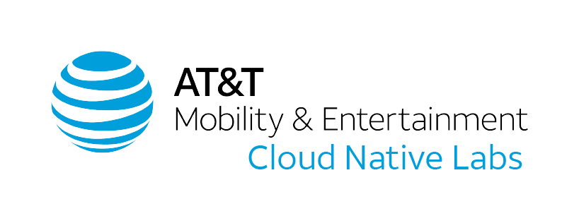

## Khan - Pod Connection Tracking Metrics Exporter

#

Khan captures connection tracking snapshots on Pods, and Nodes and exposes them as  prometheus metrics. Note that the metrics don't constitute realtime connection info, only snapshots that are polled with a default period of 30s.

The use case for this application is for tracking down pods/services that are leaking connections or finding an unknown client that is overloading a server.

This application is composed of a 'controller' that runs as a deployment. The controller is mainly an API for the node agents to retrieve mappings of IP-to-pod for IPs found in the conntrack table. The 'agent' runs as a daemonset on each node and captures the conntrack table and converts it to a set of prometheus metrics.

## Metrics
There is one metric exposed, 'khan_connection' which is a counter. The following labels are included with this metric:
* node: Node name of the host the agent is running on
* src_type: This is the type of host for source of the connection. It depends on a mapping of the source IP address to a specific type. Possible values are:
  * pod: mapped by pod IP
  * service: mapped by cluster IP
  * node: mapped by node IP
  * network: tied to overlay network (flannel). depends on nodes containing podCIDR. network address of podCIDR becomes the mapped address
  * gateway: mapped to gateway address. also depends on nodes containing podCIDR. currently, first address of podCIDR (x.x.x.1) becomes the mapped address
* src_ip: IP of the source of the connection
* src_ns: Source namespace (pods and services only) of the source of the connection
* src_app: Value of the label 'app' for the source pod or service
* src_name: Name for the source of connection
* dst_type: This is the type of host for destination of the connection. It depends on a mapping of the destination IP address to a specific type. Possible values are same as src_type
* dst_ip: IP of the destination of the connection
* dst_ns: Source namespace (pods and services only) of the source of the connection
* dst_app: Value of the label 'app' for the destination pod or service
* dst_name: Name for the destination of connection

## Additional info

  	

Maintained and in-use by the Platform Team @ AT&T Entertainment Cloud Native Labs.

Distributed under the AT&T MIT license. See ``LICENSE`` for more information.